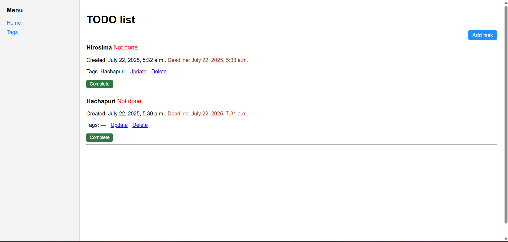
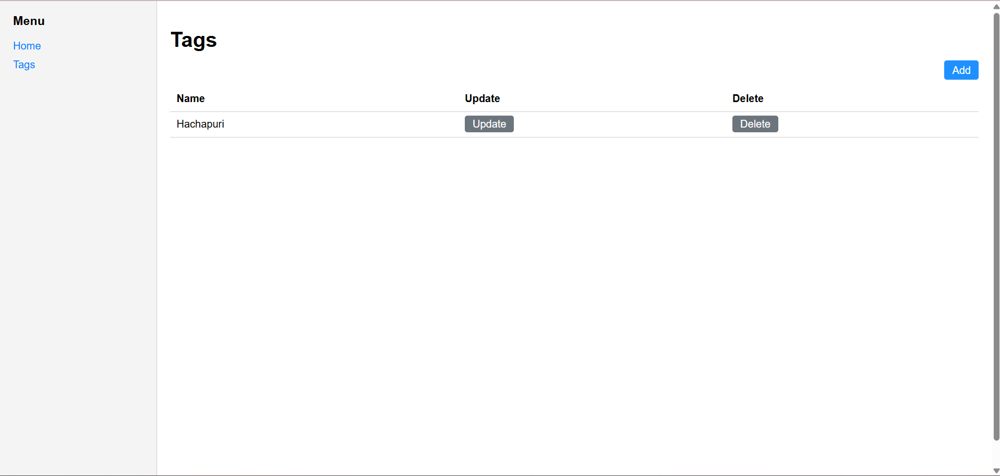

Todo List

Purpose

This is a simple task management web application built with Django. It allows users to create, update, and manage tasks, assign tags, and mark tasks as completed or canceled.

Screenshots

✏️ Task Form Page

Allows users to create or edit a task, assign tags, and set its status.

📋 Main Task List Page

Displays a list of all tasks with their statuses, tags, and actions.

